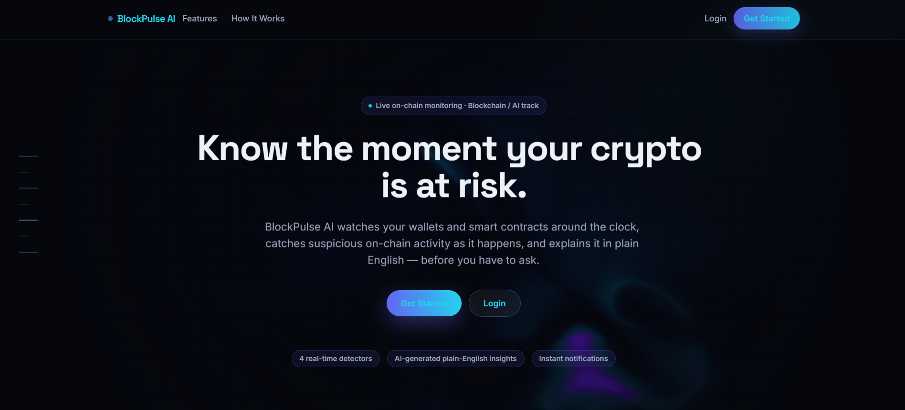
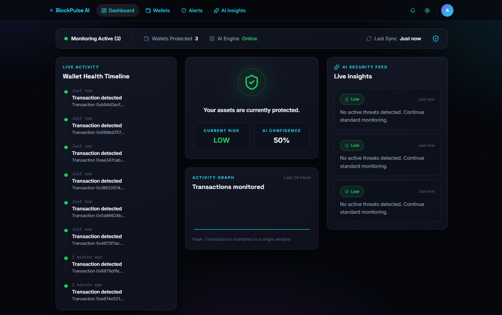
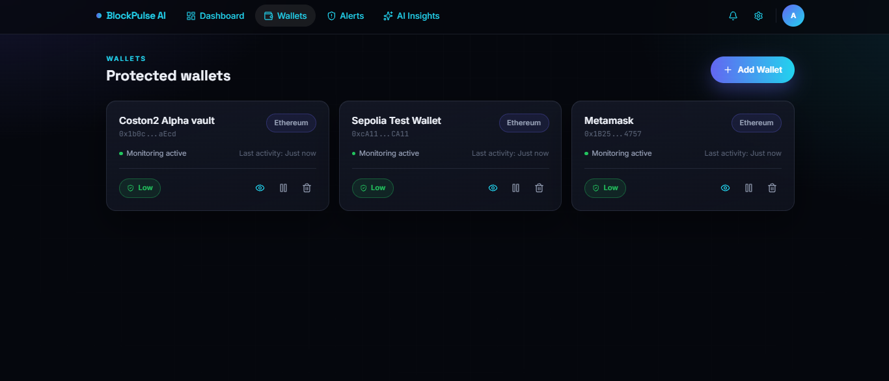
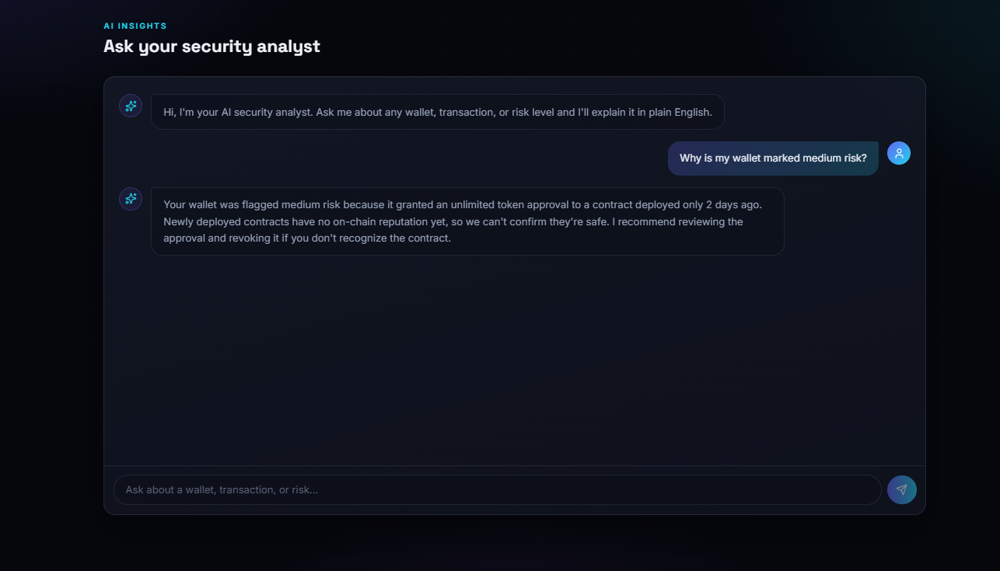
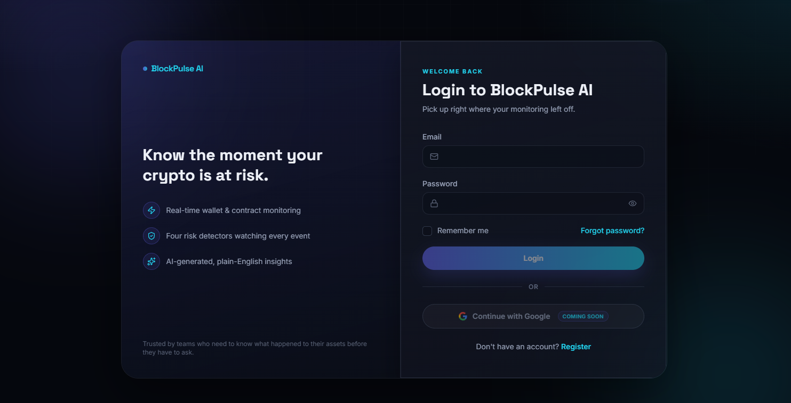
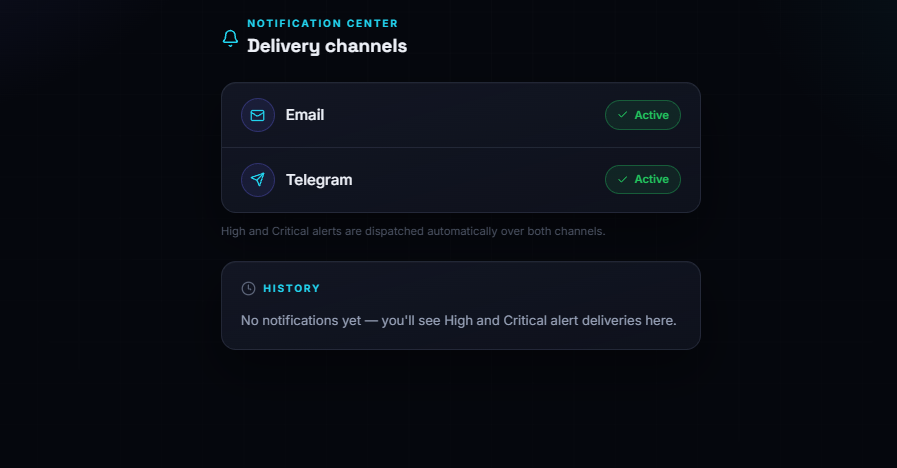
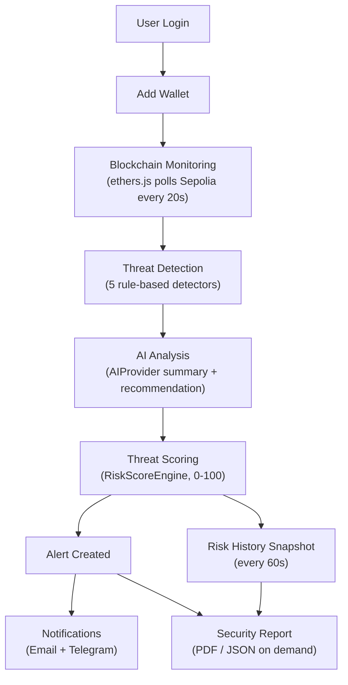
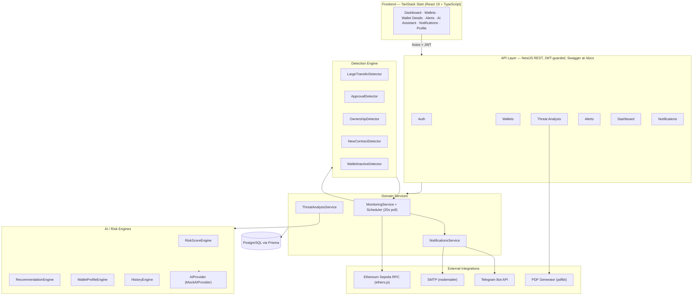

<div align="center">

# BlockPulse AI

**AI-powered blockchain security monitoring — know the moment your crypto is at risk.**

BlockPulse AI watches your wallets on Ethereum Sepolia around the clock, scores every wallet's threat level in real time, and explains what happened in plain English before you have to ask.

[](LICENSE)


[](https://github.com/0xAnandDev/BlockPulse-AI/stargazers)

[Overview](#overview) •
[Features](#features) •
[Screenshots](#screenshots) •
[Architecture](#architecture) •
[Installation](#installation) •
[API](#api-overview) •
[Roadmap](#roadmap)

</div>

---

## Table of Contents

- [Overview](#overview)
- [Features](#features)
- [Screenshots](#screenshots)
- [Demo Workflow](#demo-workflow)
- [Architecture](#architecture)
- [Folder Structure](#folder-structure)
- [Tech Stack](#tech-stack)
- [API Overview](#api-overview)
- [Installation](#installation)
- [Environment Variables](#environment-variables)
- [Security Features](#security-features)
- [AI Security Assistant](#ai-security-assistant)
- [Monitoring Engine](#monitoring-engine)
- [Notifications](#notifications)
- [PDF Security Reports](#pdf-security-reports)
- [Development](#development)
- [Performance Notes](#performance-notes)
- [Roadmap](#roadmap)
- [Contributing](#contributing)
- [License](#license)

---

## Overview

**The problem.** Crypto holders have no single place to know when something risky happens to their wallets — an unlimited approval, a sudden large transfer, an ownership change on a contract they interact with. Checking Etherscan, wallet apps, and community bots after the fact is reactive, manual, and easy to miss.

**The solution.** BlockPulse AI continuously polls the wallets you register, runs every new on-chain event through a rule-based detection engine, turns detections into a weighted 0–100 threat score with a plain-English AI summary, and pushes High/Critical alerts straight to email and Telegram — with a full audit trail (risk history, alerts, PDF reports) you can hand to anyone.

**Who it's for.** Individuals and teams who hold funds in EOAs or interact with smart contracts on Ethereum (Sepolia in this build) and want continuous, explainable, automated risk visibility instead of manually watching a block explorer.

**Core pipeline:**

```
Monitor → Detect → Score → Explain → Notify → Report
```

---

## Features

| Feature | Description |
|---|---|
| 🔐 **JWT Authentication** | Email/password registration and login, 15-minute access tokens, httpOnly rotating refresh-token cookies |
| 👛 **Wallet Management** | Add, rename, pause, and remove wallets to monitor, scoped per user |
| ⛓️ **Blockchain Event Tracking** | Polls Ethereum Sepolia every 20s via ethers.js, incrementally scans new blocks per wallet, dedupes on-chain events |
| 🕵️ **Threat Detection Engine** | 5 rule-based detectors: large transfers, unlimited approvals, ownership changes, new-contract interactions, wallet inactivity |
| 📊 **Threat Scoring** | Configurable weighted 0–100 risk score with repeated-event multiplier, mapped to Safe/Low/Medium/High/Critical |
| 🧠 **AI Security Assistant** | Per-wallet chat that answers questions grounded in that wallet's real score, alerts, and profile |
| 💡 **AI Recommendations** | Auto-generated, category-specific remediation advice ("revoke this approval", "verify this transfer") |
| 📈 **Risk History** | Threat-score snapshots recorded every 60s, plotted as a live trend chart |
| 🧾 **Wallet Security Profile** | Transaction counts, unique recipients, approvals, ownership changes, average value, monitoring duration |
| 🖥️ **Live Wallet Dashboard** | Aggregated protection status, activity graph, live insight feed across all wallets |
| ⏱️ **Live Monitoring Status** | Real-time scan phase (scanning / analyzing / running AI analysis) with next-scan countdown |
| 🚨 **Alert Engine** | Persists every detection with severity + status, deduped and cooldown-protected |
| 🔔 **Notification Center** | Delivery history with per-channel status (sent / failed / pending) |
| 📧 **Email Notifications** | Automatic SMTP email on every High/Critical alert (via nodemailer) |
| 📲 **Telegram Notifications** | Automatic Telegram Bot API message on every High/Critical alert |
| 📄 **PDF Security Reports** | On-demand, downloadable PDF (or JSON) report per wallet, generated with pdfkit |
| 👤 **Real User Profile** | Profile page and header menu driven by the authenticated user's actual account data |
| 📘 **Swagger API Docs** | Full interactive OpenAPI documentation at `/docs` |

---

## Screenshots

<div align="center">

### Landing Page


<br/><br/>

### Live Dashboard


<br/><br/>

<table>
<tr>
<td width="50%" align="center">
<b>Protected Wallets</b><br/><br/>

</td>
<td width="50%" align="center">
<b>AI Security Chat</b><br/><br/>

</td>
</tr>
<tr>
<td width="50%" align="center">
<b>Login</b><br/><br/>

</td>
<td width="50%" align="center">
<b>Notification Center</b><br/><br/>

</td>
</tr>
</table>

</div>

---

## Demo Workflow



---

## Architecture



---

## Folder Structure

```
BlockPulse-AI/
├── backend/                          # NestJS API
│   ├── prisma/
│   │   ├── schema.prisma             # User, Wallet, BlockchainEvent, Alert, AIInsight, RiskHistory, Notification
│   │   └── migrations/               # 5 migrations tracking schema evolution
│   └── src/
│       ├── auth/                     # Register/login/refresh/logout, JWT strategies & guards
│       ├── users/                    # Current-user profile endpoint
│       ├── wallets/                  # Wallet CRUD (controller/service/repository/entity)
│       ├── ethereum/                 # ethers.js provider, Sepolia RPC, ABI interfaces
│       ├── monitoring/               # Scheduler, block scanner, 5 detectors, status service
│       │   └── detectors/
│       ├── threat-analysis/          # Risk score / recommendation / profile / history engines,
│       │   │                         # AIProvider + MockAIProvider, PDF report builder
│       │   ├── interfaces/
│       │   └── dto/
│       ├── alerts/                   # Alert querying + DTO mapping
│       ├── ai-insights/              # AI-generated insight records API
│       ├── notifications/            # Email + Telegram providers, delivery history
│       │   └── providers/
│       ├── dashboard/                # Aggregated summary endpoint
│       ├── prisma/                   # PrismaService/PrismaModule
│       └── main.ts                   # Helmet, CORS, ValidationPipe, Swagger bootstrap
│
├── frontend/                         # TanStack Start (React 19)
│   └── src/
│       ├── routes/                   # File-based routes: dashboard, wallets, wallets.$id,
│       │                             # alerts, notifications, profile, settings, auth pages
│       ├── components/
│       │   ├── dashboard/            # AppShell, WalletCard, AlertCard, ActivityChart,
│       │   │                         # WalletAssistantChat, RiskBadge, ...
│       │   ├── auth/                 # Auth layout components
│       │   └── ui/                   # Button, Input, Modal, Select, Skeleton, ...
│       └── lib/
│           ├── api/                  # Axios client, per-domain API modules
│           └── dashboard/            # Shared types + WalletsProvider context
│
├── screenshots/                      # README screenshots
├── docs/                             # Architecture notes
├── docker-compose.yml                # Local PostgreSQL for development
└── LICENSE                           # MIT
```

---

## Tech Stack

### Frontend

| Technology | Purpose |
|---|---|
| React 19 + TypeScript | UI framework |
| TanStack Start / TanStack Router | File-based routing, SSR shell |
| Tailwind CSS 4 | Styling |
| Axios | HTTP client with token-refresh interceptor |
| react-hook-form + Zod | Form state and validation |
| motion | Animations |
| lucide-react | Icons |
| Vite 8 / Vitest | Build tool and test runner |

### Backend

| Technology | Purpose |
|---|---|
| NestJS 11 | Modular API framework |
| TypeScript | Language, strict mode |
| class-validator / class-transformer | DTO validation |
| @nestjs/schedule | Interval-based monitoring scheduler |
| @nestjs/throttler | Global rate limiting |
| @nestjs/swagger | OpenAPI docs at `/docs` |
| Helmet, cookie-parser | HTTP security headers, cookie parsing |

### Database

| Technology | Purpose |
|---|---|
| PostgreSQL | Primary datastore |
| Prisma ORM | Schema, migrations, type-safe queries |

### Authentication

| Technology | Purpose |
|---|---|
| JWT (`@nestjs/jwt`, `passport-jwt`) | Access + refresh token strategies |
| bcrypt | Password and refresh-token hashing |
| httpOnly cookies | Refresh-token storage, rotated on use |

### Blockchain

| Technology | Purpose |
|---|---|
| ethers.js v6 | Sepolia RPC provider, block/log/receipt fetching |
| Ethereum Sepolia | Monitored network |

### AI

| Technology | Purpose |
|---|---|
| `AIProvider` interface + `MockAIProvider` | Rule-based wallet analysis, recommendations, and Q&A — swappable for a real LLM without touching callers |

### Notifications

| Technology | Purpose |
|---|---|
| nodemailer | SMTP email delivery |
| Telegram Bot API (`fetch`) | Telegram message delivery |
| pdfkit | PDF report generation |

### Dev Tools

| Technology | Purpose |
|---|---|
| ESLint + typescript-eslint | Linting |
| Jest / Vitest | Testing |
| Prisma Studio | Database inspection GUI |
| Docker Compose | Local PostgreSQL for development |

---

## API Overview

All endpoints are served from the API root (default `http://localhost:4000`). Interactive docs live at **`/docs`**.

| Method | Endpoint | Description | Auth |
|---|---|---|:---:|
| `POST` | `/auth/register` | Create an account | – |
| `POST` | `/auth/login` | Log in, returns access token + sets refresh cookie | – |
| `POST` | `/auth/refresh` | Rotate the access token using the refresh cookie | 🍪 |
| `POST` | `/auth/logout` | Revoke the refresh token, clear the cookie | 🍪 |
| `GET` | `/users/me` | Get the current authenticated user | ✅ |
| `GET` | `/wallets` | List the current user's wallets | ✅ |
| `POST` | `/wallets` | Add a wallet to monitor | ✅ |
| `GET` | `/wallets/:id` | Get a single wallet | ✅ |
| `PATCH` | `/wallets/:id` | Update a wallet (name, network, monitoring) | ✅ |
| `DELETE` | `/wallets/:id` | Remove a wallet | ✅ |
| `GET` | `/wallets/:id/security` | Threat score, confidence, profile, recommendations, risk history | ✅ |
| `GET` | `/wallets/:id/events` | Recent blockchain events for a wallet | ✅ |
| `GET` | `/wallets/:id/alerts` | Alerts detected for a wallet | ✅ |
| `GET` | `/wallets/:id/monitoring-status` | Live scan phase, last scanned block, next-scan countdown | ✅ |
| `POST` | `/wallets/:id/assistant` | Ask the AI security assistant a question about this wallet | ✅ |
| `GET` | `/wallets/:id/report` | Security report — JSON, or PDF with `?format=pdf` | ✅ |
| `GET` | `/alerts` | All alerts for the current user | ✅ |
| `GET` | `/alerts/open` | Only open alerts | ✅ |
| `GET` | `/ai-insights` | AI-generated insight records for the current user | ✅ |
| `GET` | `/monitoring/events` | Latest blockchain events across all wallets | ✅ |
| `GET` | `/notifications` | Notification delivery history | ✅ |
| `GET` | `/dashboard` | Aggregated dashboard summary | ✅ |
| `GET` | `/health` | Health check | – |

---

## Installation

### Prerequisites

- Node.js 20+
- PostgreSQL 16 (or Docker)
- npm

### 1. Clone

```bash
git clone https://github.com/0xAnandDev/BlockPulse-AI.git
cd BlockPulse-AI
```

### 2. Start PostgreSQL

```bash
docker compose up -d postgres
```

### 3. Configure the backend

```bash
cd backend
cp .env.example .env
# edit .env — set DATABASE_URL, JWT_ACCESS_SECRET, JWT_REFRESH_SECRET at minimum
```

### 4. Install dependencies and run migrations

```bash
npm install
npm run prisma:migrate
```

### 5. Start the backend

```bash
npm run dev
# API on http://localhost:4000, Swagger docs on http://localhost:4000/docs
```

### 6. Start the frontend

```bash
cd ../frontend
npm install
npm run dev
# App on http://localhost:3000
```

### 7. Create an account

Register a user from the app, add a wallet address on Ethereum Sepolia, and the monitoring scheduler picks it up on its next 20-second tick.

---

## Environment Variables

### Backend (`backend/.env`)

| Variable | Purpose |
|---|---|
| `PORT` | HTTP port for the NestJS server (default `4000`) |
| `NODE_ENV` | `development` / `production` — controls the secure cookie flag |
| `CORS_ORIGIN` | Comma-separated list of allowed frontend origins |
| `DATABASE_URL` | PostgreSQL connection string used by Prisma |
| `JWT_ACCESS_SECRET` | Signing secret for short-lived access tokens |
| `JWT_REFRESH_SECRET` | Signing secret for refresh tokens |
| `SEPOLIA_RPC_URL` | Ethereum Sepolia JSON-RPC endpoint (defaults to a public RPC if unset) |
| `LARGE_TRANSFER_THRESHOLD_ETH` | ETH value above which a transfer is flagged High severity (default `1`) |
| `WALLET_INACTIVE_HOURS` | Hours of silence before a wallet is flagged inactive (default `24`) |
| `SMTP_HOST` / `SMTP_PORT` / `SMTP_SECURE` / `SMTP_USER` / `SMTP_PASS` / `SMTP_FROM` | Optional SMTP credentials for email notifications — unset means emails are logged, not sent |
| `TELEGRAM_BOT_TOKEN` | Optional Telegram bot token for notifications — unset means Telegram sends are logged, not sent |
| `TELEGRAM_CHAT_ID` | Shared operator chat ID notifications are sent to, until per-user preferences exist |

### Frontend

| Variable | Purpose |
|---|---|
| `VITE_API_URL` | Backend base URL (optional — defaults to `http://localhost:4000`) |

> No secrets are committed to this repository. `.env` files are git-ignored; copy `backend/.env.example` and fill in your own values.

---

## Security Features

- **Authentication** — email/password with bcrypt (12 salt rounds); 15-minute JWT access tokens; 7-day refresh tokens stored **httpOnly, sameSite=lax**, hashed server-side, and rotated on every refresh.
- **Authorization** — every wallet-scoped endpoint re-verifies wallet ownership against the authenticated user before returning data (`ForbiddenException` / `NotFoundException` otherwise).
- **Input validation** — a global `ValidationPipe` (`whitelist`, `forbidNonWhitelisted`, `transform`) rejects any request body that doesn't match its DTO, returning HTTP 422.
- **Rate limiting** — a global throttler caps requests to 100 per 60 seconds per client.
- **Transport hardening** — `helmet()` HTTP headers and a credentialed, origin-restricted CORS policy.
- **Threat analysis** — a deterministic, weighted risk-scoring engine (not a black box) with a documented scoring model.
- **Notification security** — provider credentials are optional; the app degrades to logging-only rather than silently failing or crashing when unconfigured.
- **PDF reports** — generated server-side per request from the requesting user's own data, streamed directly rather than cached to disk.

---

## AI Security Assistant

Every wallet has a chat assistant (`POST /wallets/:id/assistant`) that answers questions **grounded in that wallet's real, live state** — not a generic chatbot:

- Pulls the wallet's current threat score, risk level, confidence, open alerts, security profile, and AI recommendations before answering.
- Matches the question's intent (risk reasoning, "what should I do next", approvals, ownership changes, recent activity, confidence) and answers using the actual numbers, not canned text.
- Implemented behind an `AIProvider` interface (`analyzeWallet`, `analyzeAlert`, `generateRecommendations`, `answerQuestion`) with a rule-based `MockAIProvider` — a real LLM (Claude, OpenAI, Gemini, or local) can be swapped in later by implementing the same interface, with zero changes to any caller.

---

## Monitoring Engine

- A `MonitoringScheduler` ticks every **20 seconds**, guarded against overlapping runs.
- Each monitored wallet is scanned **incrementally** — `lastProcessedBlock` is persisted per wallet, so only new blocks are ever re-scanned. The first run backfills the last 50 blocks; every tick caps at 50 blocks to avoid unbounded catch-up.
- Native ETH transfers, ERC-20 `Approval` logs, and `OwnershipTransferred` logs are decoded and deduplicated (a unique constraint on wallet + tx hash + event type).
- New events run through the 5 detectors; matches create an `Alert` + `AIInsight` atomically and — for High/Critical severity — trigger notifications.
- `MonitoringStatusService` exposes the scheduler's live phase (`scanning` → `analyzing` → `ai-analysis` → `threat-score-updated` → `idle`) and a next-scan countdown, polled by the wallet detail page.
- A separate 60-second interval snapshots every monitored wallet's threat score and confidence into `RiskHistory` for trend charting.

**Detectors:**

| Detector | Trigger | Severity |
|---|---|---|
| Large Transfer | Transfer ≥ `LARGE_TRANSFER_THRESHOLD_ETH` | High |
| Unlimited Approval | ERC-20 approval with `allowance == MaxUint256` | High |
| Ownership Changed | `OwnershipTransferred` event on a watched contract | Critical |
| New Contract Interaction | First-ever transfer to a given contract address | Medium |
| Wallet Inactivity | No activity for `WALLET_INACTIVE_HOURS` (cooldown-protected) | Low |

**Threat scoring:** a weighted sum (Large Transfer +20, Unlimited Approval +30, Ownership Changed +40, New Contract +10, Inactivity +15, with a 1.25× multiplier per repeated category), clamped 0–100 and mapped to Safe (0–20) / Low (21–40) / Medium (41–60) / High (61–80) / Critical (81–100).

---

## Notifications

- Triggered automatically whenever a **High** or **Critical** alert is created — no manual step required.
- Two channels, each behind a `NotificationProvider` interface so a real delivery integration can be swapped in later:
  - **Email** — via `nodemailer`/SMTP.
  - **Telegram** — via the Telegram Bot API.
- If SMTP or a bot token isn't configured, the provider **logs the attempt and reports not-sent** instead of throwing — the app keeps running either way.
- Every attempt is persisted with a delivery **status** (`SENT`, `FAILED`, or `PENDING`) and timestamp, visible in the Notification Center (`GET /notifications`).

---

## PDF Security Reports

`GET /wallets/:id/report` (add `?format=pdf` to download) generates a report containing:

- **Wallet overview** — name, address, network, monitoring status, monitored-since date
- **Threat assessment** — current threat score, risk level, confidence
- **Security profile** — transaction counts, unique recipients, approvals, ownership changes, large transfers, average transaction value, risk trend, monitoring duration
- **Alert summary** — total/open counts by severity, plus the most recent alerts
- **Risk history** — recent threat-score/confidence snapshots
- **AI recommendations** — the same category-driven recommendations shown in the app
- **Monitoring statistics** — total events tracked, last scanned block

Rendered server-side with `pdfkit`; the JSON form of the same report backs the PDF, so both are always in sync.

---

## Development

Backend (`backend/`):

```bash
npm run dev               # nest start --watch
npm run build              # nest build
npm run lint                 # eslint --fix
npm run test                   # jest
npm run prisma:generate          # regenerate the Prisma client
npm run prisma:migrate             # create/apply a migration
npm run prisma:studio                # open Prisma Studio
```

Frontend (`frontend/`):

```bash
npm run dev               # vite dev --port 3000
npm run build              # vite build
npm run preview              # preview the production build
npm run test                   # vitest run
npm run generate-routes          # regenerate routeTree.gen.ts
```

---

## Performance Notes

- **Incremental block scanning** — `lastProcessedBlock` per wallet means each tick only fetches new blocks, not the whole chain history.
- **Bounded catch-up** — a 50-block cap per tick prevents a single slow cycle from blocking the scheduler indefinitely.
- **Deduplication at the database layer** — a unique constraint (`walletId`, `transactionHash`, `eventType`) makes event ingestion naturally idempotent, even under retries.
- **Decoupled snapshotting** — risk-history snapshots run on their own 60-second interval, independent of the 20-second scan cycle, so dashboard reads never trigger a write.
- **Non-blocking notifications** — email/Telegram sends never throw; a delivery failure is recorded, not propagated, so it can't stall the monitoring loop.
- **Client-side caching** — the authenticated user's profile is cached in-memory on the frontend after first load instead of being re-fetched on every route change.

---

## Roadmap

- [ ] Multi-chain support (mainnet, L2s) beyond Sepolia
- [ ] Real LLM integration behind the existing `AIProvider` interface
- [ ] Per-user notification preferences (custom Telegram chat, channel toggles)
- [ ] Wallet clustering and cross-wallet correlation
- [ ] Push notifications / browser alerts
- [ ] SIEM / webhook export for security teams
- [ ] Mobile application
- [ ] CI/CD pipeline and containerized deployment

---

## Contributing

Contributions are welcome.

1. Fork the repository and create a feature branch.
2. Keep changes scoped — one feature or fix per pull request.
3. Match the existing architecture: NestJS controller → service → repository on the backend, typed API modules on the frontend.
4. Run `npm run lint` and `npm run test` in `backend/`, and `npx tsc --noEmit` in `frontend/`, before opening a PR.
5. Describe **what** changed and **why** in the PR description.

---

## License

Distributed under the **MIT License**. See [LICENSE](LICENSE) for the full text.

---

<div align="center">

Built with ❤️ using modern Web3, AI, and TypeScript technologies.

</div>
